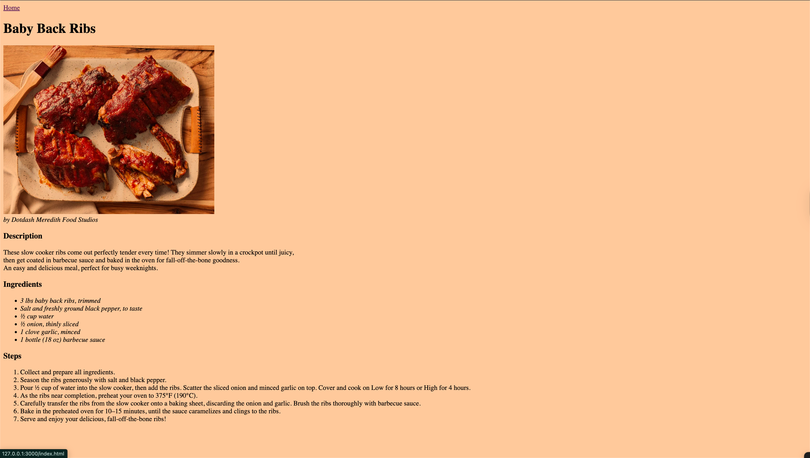
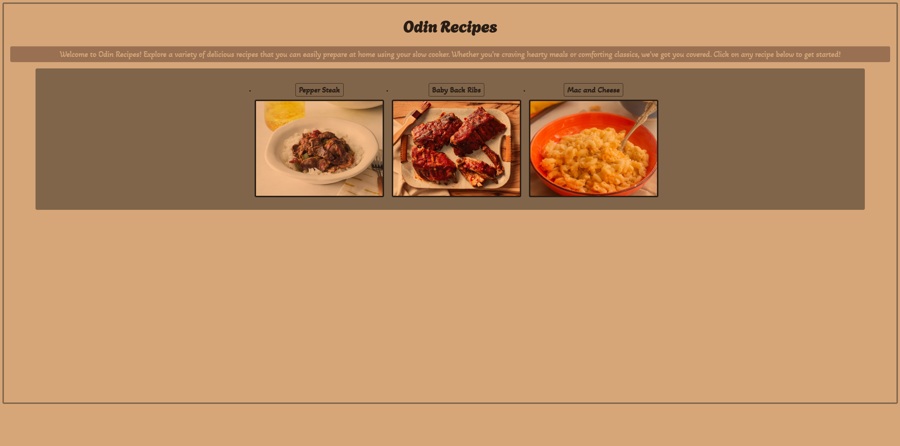
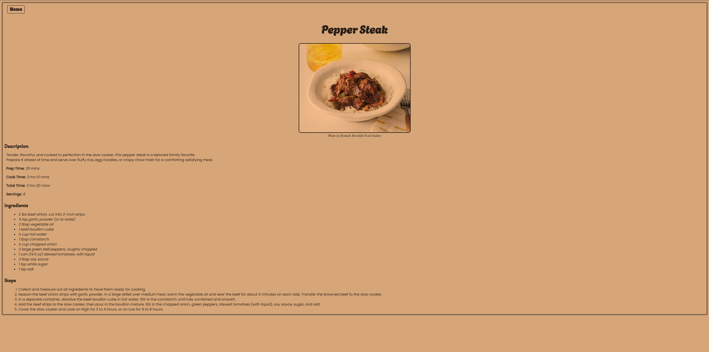
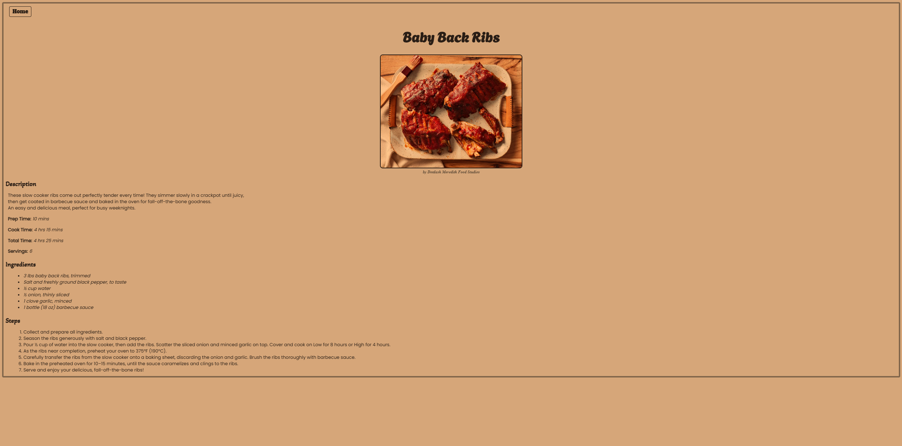
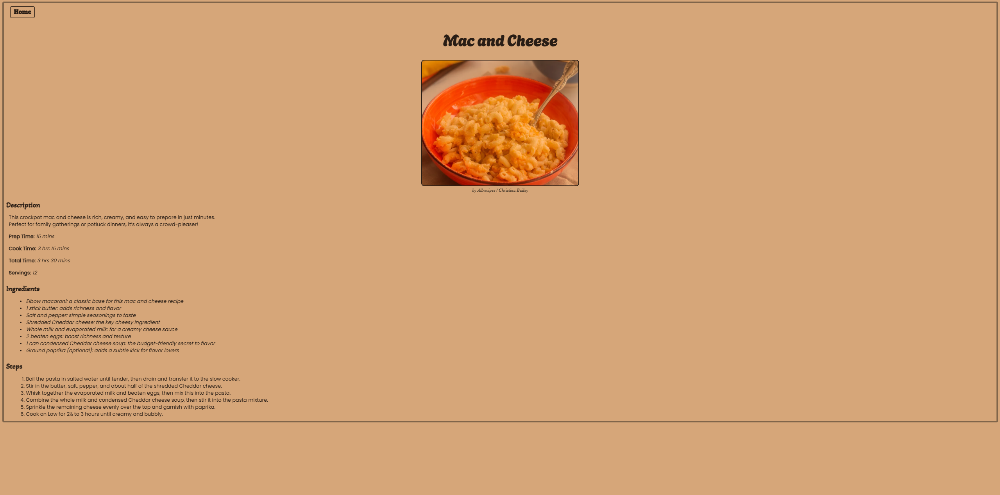

# 🍽️ Odin Recipes

A beginner-friendly HTML project from **The Odin Project** Foundations course, focused on building a simple multi-page recipe website.

## 📖 Project Overview
This repository contains a collection of recipe pages built with HTML, featuring images, descriptions, ingredients, and preparation steps. Each page includes semantic HTML, alt text for accessibility, and a consistent structure.

## 🚀 Progress & Iterations

### 🟢 Initial Setup
- Created this repository.
- Added a `README.md` file.
- Cloned the repo via SSH into the `repos` folder.
- Configured Git and commit settings.

### 1️⃣ First Iteration
- Created `index.html` in the repository folder.
- Added the standard HTML boilerplate.

### 2️⃣ Second Iteration
- Created a `recipes` directory.
- Added `peppersteak.html` with HTML boilerplate.
- Added `<h1>` with the recipe name.
- Linked Pepper Steak recipe from `index.html`.
- Added a **Home** button for navigation.

### 3️⃣ Third Iteration
- Created an `images` directory.
- Downloaded and added a Pepper Steak image.
- Added `` tag with alt text, height, and width.
- Added a description heading and paragraph.
- Added commented-out time description.
- Listed ingredients (unordered list).
- Listed preparation steps (ordered list).
- Added `<figcaption>` with author description.

### 4️⃣ Fourth Iteration
- Created `babybackribs.html` with HTML boilerplate.
- Added header, image with alt text, and `<figcaption>`.
- Added short description, ingredients list, and steps.
- Created `macandcheese.html` with all previous features.

## 📸 Website History Preview

  
<b>1st Installment</b>

  

    <figcaption><b>📜 Main Page</b></figcaption>
    
    <figcaption><b>🥩 Pepper Steak</b></figcaption>
    
    <figcaption><b>🩻 Baby Back Ribs</b></figcaption>
    
    <figcaption><b>🫕 Mac and Cheese</b></figcaption>
    
  

  
<b>2nd Installment</b>

  

    <figcaption><b>📜 Main Page</b></figcaption>
    
    <figcaption><b>🥩 Pepper Steak</b></figcaption>
    
    <figcaption><b>🩻 Baby Back Ribs</b></figcaption>
    
    <figcaption><b>🫕 Mac and Cheese</b></figcaption>
    
  

## 🛠️ Technologies Used
- HTML5
- CSS
- Markdown
- Git & GitHub

## 📚 Lessons Learned
- Structuring HTML projects with directories for recipes and images.
- Writing semantic HTML and descriptive alt texts.
- Creating consistent page layouts.